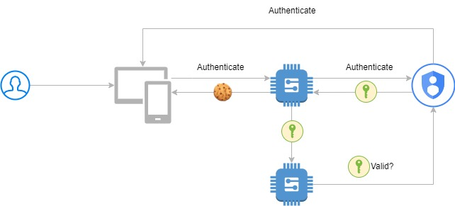
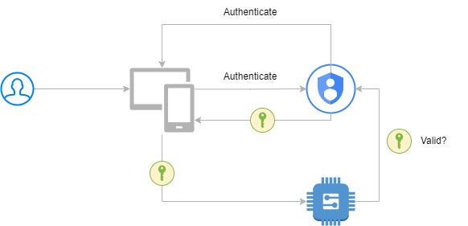
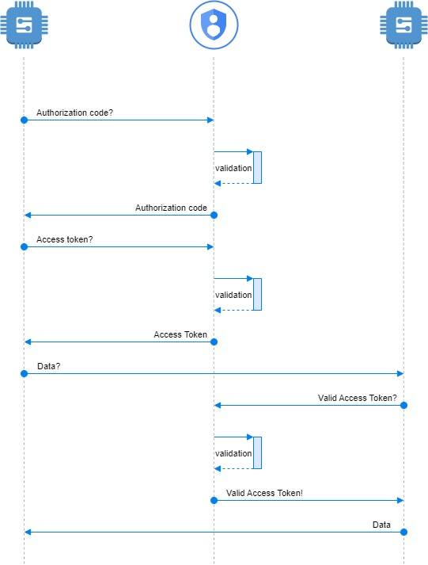
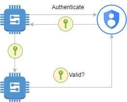

# Authentication

Authentication can be defined as:

>The process of verifying whether someone or something is, in fact, who or what it says it is.

Meaning we want to ensure the entity requesting a service or data from one of our applications has provided a valid authentication and is authorized to access said service or data.

At Studio Hyperdrive, we prefer to work following the OAuth2 specification.

## Table of Contents

    
Toggle

* [Security Baseline](./SECURITY_BASELINE.md)
* [Authentication](#authentication)
    * [Authentication types](#authentication-types)
    * [Authenticating with OAuth2](#authenticating-with-oauth2)
    * [Authentication flows](#authentication-flows)
        * [User authentication](#user-authentication)
        * [M2M authentication](#m2m-authentication)
    * [SSH](#ssh)
    * [VPN](#vpn)
* [Mobile App Development](./MOBILE%20DEVELOPMENT.md)

## Authenticating with OAuth2

There are a couple key components and concepts in OAuth2 that need to be addressed:

* Identity Provider: a trusted provider of user identity
* Service Provider: an app/website/service, provides a service and/or data
* Authentication: verify the identity of a user or entity, happens first
* Authorization: verify whether a user or entity has access to a protected resource, happens **after** authentication 
* IAM: Identity & Access Management platforms combine authentication and authorization in 1 platform

At Studio Hyperdrive, we prefer to work with trusted SaaS platforms, to ensure a secure and up-to-date platform for authentication and authorization. Some examples: Okta, Auth0, AzureAD, AWS Cognito.

## Authentication flows

Depending on the context, a different flow will be used to authenticate a user or entity. We prefer to limit the flows used to common industry practices.

### User authentication

For user authentication, the Authorization Code Flow should be preferred. PKCE tokens should be implemented unless technical restrictions prevent their use.

The Authorization Code Flow (with PKCE) can be visualized as such:

")

From left to right, we can identify the key entities:

* the user or entity, making the request
* the application or service, executing the request
* the IDP solution, verifying the identity of the user or entity
* the resource provider, granting access to a protected resource

In a typical SPA setup, a "backend-for-frontend" (BFF) is used to connect the client-facing application to the API. Authentication is handled by the BFF, secure cookies (httpOnly) are used for session management:

In a setup without BFF, the Authorization Code Flow can be used as well. Authentication should be stored securely on the clients device following common practices. Longterm storage of credentials, or storage in insecure environments should be avoided.

In a mobile context, a setup without BFF is possible. Secure device storage can be used to store the authentication information (see [Mobile App Development](./MOBILE%20DEVELOPMENT)).

### M2M authentication

When authenticating in a context without users, the Client Credentials Flow should be preferred:

From left to right, we can identify the key entities:

* the application or service, making the request
* the IDP solution, verifying the identity of the user or entity
* the resource provider, granting access to a protected resource

In a typical setup, communication between service providers is pretty straightforward:

